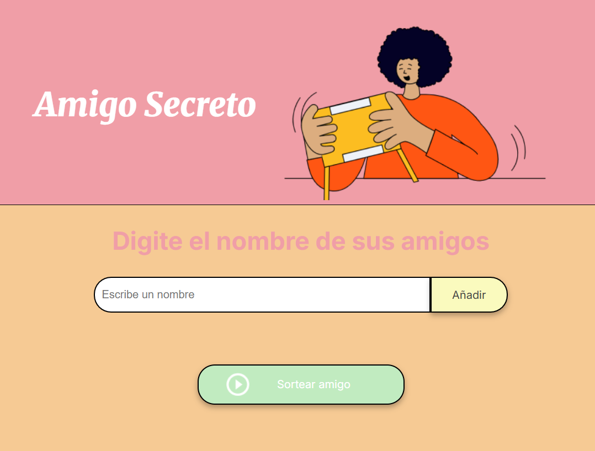

# challenge amigo secreo

Este proyecto permite a los usuarios agregar nombres a una lista y realizar un sorteo aleatorio para seleccionar un amigo secreto!!
# Lista de Amigos

## Descripción del Proyecto
Este proyecto es una aplicación web interactiva que permite a los usuarios agregar nombres de amigos a una lista y realizar un sorteo aleatorio para elegir un "amigo secreto". La funcionalidad principal es ayudar a organizar dinámicamente sorteos entre amigos de manera fácil y rápida, sin necesidad de realizar anotaciones manuales. 

La aplicación proporciona una interfaz simple en la que los usuarios pueden ingresar nombres, visualizar la lista de amigos ingresados y, con un solo clic, seleccionar un ganador al azar. Es ideal para juegos, intercambios de regalos o cualquier evento que requiera una elección aleatoria entre participantes.

## Funcionalidades

### 1. Agregar nombres
Los usuarios pueden ingresar el nombre de un amigo en un campo de texto y agregarlo a una lista visible al hacer clic en "Adicionar".

```javascript
function agregarAmigo() {
    if (!inputAmigo.value) {
        alert("Debe ingresar un nombre.");
        return;
    }
    listaAmigos.push(inputAmigo.value);
    ulListaAmigos.innerHTML += `<li>${inputAmigo.value}</li>`;
}
```

### 2. Validar entrada
Si el campo de texto está vacío, el programa mostrará una alerta pidiendo un nombre válido.

```javascript
if (!inputAmigo.value) {
    alert("Debe ingresar un nombre.");
    return;
}
```

### 3. Visualizar la lista
Los nombres ingresados aparecerán en una lista debajo del campo de entrada.

```javascript
listaAmigos.push(inputAmigo.value);
ulListaAmigos.innerHTML += `<li>${inputAmigo.value}</li>`;
```

### 4. Iterar sobre el arreglo
Se usa un bucle `for` para recorrer el arreglo `listaAmigos` y crear elementos de lista (`<li>`) para cada amigo.

```javascript
for (let i = 0; i < listaDeAmigos.length; i++) {
    let item = document.createElement("li");
    item.innerHTML = listaDeAmigos[i];
    listaElementos.appendChild(item);
}
```

### 5. Sorteo aleatorio
Al hacer clic en el botón "Sortear Amigo", se selecciona aleatoriamente un nombre de la lista y se muestra en la página.

```javascript
function sortearAmigo() {
    const random = Math.floor(Math.random() * listaAmigos.length);
    const amigoSecreto = listaAmigos[random];
    ulResultado.innerHTML = `<li>El amigo secreto es: ${amigoSecreto}</li>`;
}
```

## Cómo ejecutar el proyecto
1. Clona este repositorio:
   ```sh
   git clone https://github.com/Katy0923/challenge-amigo-secreto-Katerine-Ruiz.git
   ```
2. Abre el archivo `index.html` en tu navegador.

## Tecnologías Utilizadas
Este proyecto utiliza las siguientes tecnologías:
- **HTML**: Para la estructura de la página.
- **CSS**: Para el diseño y la presentación visual.
- **JavaScript**: Para la lógica interactiva de la aplicación.

## Contribuciones
¡Las contribuciones son bienvenidas! Si deseas mejorar el código, abre un _pull request_ con tus cambios.

## Licencia
Este proyecto está bajo la licencia MIT.


